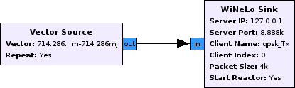
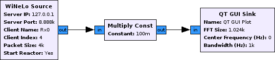

.. gr-winelo documentation master file, created by
   sphinx-quickstart on Mon Oct 15 14:02:24 2012.
   You can adapt this file completely to your liking, but it should at least
   contain the root `toctree` directive.

:special-members: __init__

Welcome to gr-winelo's documentation!
=====================================

gr-winelo is a simulation framework for GNU Radio.
WiNeLo stands for Wireless Networks in the Loop, meaning that tests and simulations of wireless networks can be easily interchanged.
This is achieved by replacing the RF hardware and the radio channel by virtual equivalents, which permit the simulation of GNU Radio flowgraphs under similar conditions to those that would occur in real world tests.
gr-winelo uses a server-client infrastructure, where the server is responsible for simulating the radio channel.
Clients on the other hand link a GNU Radio flowgraph to the server.

So far gr-winelo offers support for dynamically connecting and disconnecting clients, GNU Radio time stamps and the COST 207 channel models.

gr-winelo for the impatient
===========================

First of all we have to start the server.
The server needs to know what kind of channel model we want to use and the options for that channel model.
For this example we will be using the COST 207 typical urban model.
The server has to know the sample rate with which the flowgraphs are running, in order to adjust the delays of the channel model to this rate.
*fmax* sets the maximum Doppler frequency for the Doppler spectra in the channel model::

        ./server.py --model cost207typicalurban --opts sample_rate 10e6 fmax 100
       
Now that the server is running we can start connecting some GNU Radio flowgraphs.
Below you will find some example flowgraphs.
Notice that they are almost identical to usual flowgraphs, except that they are using WiNeLo sink/source blocks instead of the traditional UHD-equivalents.
The parameters of the blocks are self-explanatory.
Anyways, here is a quick rundown:

* Server IP: IP of the server. If the clients are running on the same machine as the server just use 127.0.0.1, which is the default value.
* Server Port: Port under which the WiNeLo-Server is accessible. If you did not specify the port while starting the server, the default port 8888 is used.
* Client Name: Name of the Client. Needs to be unique.
* Client Index: Deprecated. Leave the default value.
* Packet Size: How many samples are passed to the server before waiting for a new request. If the connected clients have different packet sizes the lowest will be used. This parameter is important for synchronisation of the clients. I noticed that WiNeLo gets unstable if the packet size is larger than 4000.
* Start Reactor: This one is a little complicated. WiNeLo relies on [twisted]_ for transmitting samples. The twisted reactor checks for incoming and outgoing traffic and must not be started more than once per thread, meaning that if we want to have multiple WiNeLo sinks or sources in one GNU Radio flowgraph only the one that is instantiated the latest can start the reactor. This requires a little tuning by hand.

	QPSK Transmitter

	QPSK Receiver

As soon as at least one transmitter and one receiver are connected to the server, samples will be requested and transmitted. 

Known Bugs
==========

* **The server does not transmit when I connect a flowgraph with more than one sink/source.** This problem is caused by the way the server handles new connections. One work-around is to connect a dummy flowgraph with only one WiNeLo sink or source block to the server. This will kick-start the server. After that the dummy flowgraph can be removed.
* **The server crashes when I set a large packet size.** Somehow twisted cannot cope with large packets. The maximum for me are 4000. So far the only solution is using smaller packets.

API Description
===============

.. toctree::
   :maxdepth: 2

   winelo_channel
   winelo_server
   winelo_client

Indices and tables
==================

* :ref:`genindex`
* :ref:`modindex`
* :ref:`search`

References
==========
.. [paetzold2011mobile] M. Pätzold, Mobile Radio Channels, John Wiley & Sons, 2011.
.. [twisted] http://twistedmatrix.com/

