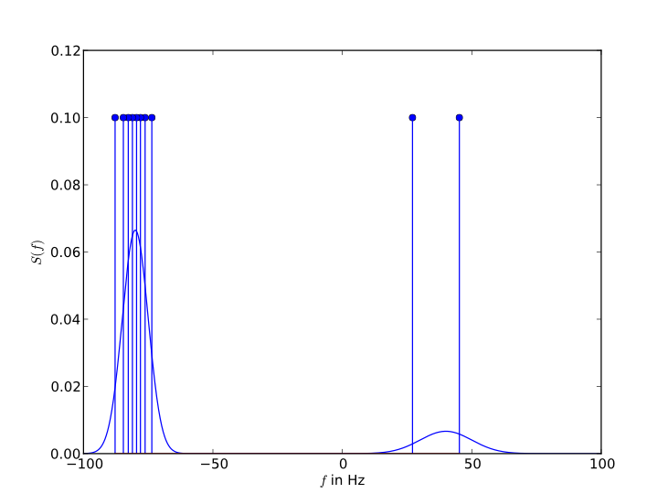

:special-members: __init__

Radio Channels
**************
.. automodule:: winelo.channel

An example detailing the use of this module can be found below. :ref:`channel_example`

Sum of Sinusoids
================
.. automodule:: winelo.channel.spec2sos
        :members: 
        :special-members:

Sum of Cisoids
==============
.. automodule:: winelo.channel.spec2soc
        :members:
        :special-members:

Gaussian Random Process
=======================
.. automodule:: winelo.channel.gauss_rand_proc_c
        :members:
        :special-members:

Models
======

Channel Sounder Measurement
---------------------------
.. automodule:: winelo.channel.models.cs_meas_cc
        :members:

Rayleigh Channel
----------------
.. automodule:: winelo.channel.models.rayleigh_cc
        :members:

COST 207
--------
.. automodule:: winelo.channel.models.cost207
        :members:

.. automodule:: winelo.channel.models.cost207.dopplerspecs
        :members:
        :special-members:

Rural Area
++++++++++
.. automodule:: winelo.channel.models.cost207.rural_area_cc
        :members:

Typical Urban
+++++++++++++
.. automodule:: winelo.channel.models.cost207.typical_urban_cc
        :members:

Bad Urban
+++++++++
.. automodule:: winelo.channel.models.cost207.bad_urban_cc
        :members:

Hilly Terrain
+++++++++++++
.. automodule:: winelo.channel.models.cost207.hilly_terrain_cc
        :members:

.. _`channel_example`:

Example
=======
The easiest way to get a complex Gaussian process is to use the corresponding Block that comes with **gr-winelo**.
The block is also available in GNU Radio companion in the category its parameters are the following.
First we create an instance of a COST 207 model::

	from winelo.channel.models import cost207
	myspecs = cost207.dopplerspecs(N = 2001, fmax = 100)
	gauss1 = myspecs.get_gauss1()

where *N* is the number of points where the Doppler spectra are evaluated and *fmax* is the maximum Doppler shift.
The various spectra can then be extracted with the *get_gauss1*, *get_gauss2*, *get_jakes* and *get_rice* methods.
They return a tuple which contains two Numpy arrays: a $N \times 1$ array containing frequencies that are evenly spread from *-fmax* and *fmax*, and also a FIXME N \times 1 array which contains the power of the Doppler spectrum at these frequencies.

If we now wish to turn this Doppler spectrum into a sum of sinusoids or cisoids the corresponding libraries have to be loaded.
Since the Gauss1 spectrum of the COST 207 model is uneven, we will be using the sum of cisoids approach.::

	from winelo.channel import spec2soc
	gauss1_soc = spec2soc( gauss1, N=10, method='gmea')

here *N* is the number of cisoids that we want to use, and *gmea* stands for generalized methods of equal areas which is used to compute the frequencies and amplitudes of the cisoids, given the spectrum *gauss1*.

Let's have a look at our sum of cisoids and how it relates to the Doppler spectrum supplied by the COST 207 methods::

	gauss1_soc.plot_spectra()

which gives us the following plot:

	Sum of Cisoids and its spectrum

we can get the actual sum of cisoids with the method *gauss1_soc.get_soc()*, which returns a list of *N* tuple, where each tuple is a pair of the frequency and the amplitude of one cisoid.       :members:

References
==========

.. [paetzold2011mobile] M. Pätzold, Mobile Radio Channels, John Wiley & Sons, 2011.

