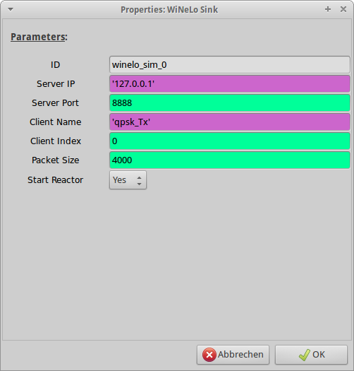

Client
******

As with the server module, it should never be necessary that you as a user have to directly work with the Twisted client.
If you want to connect GNU Radio flowgraphs to the WiNeLo server, the easiest way it to rely on the GNU Radio Companion bindings that we created.
The bindings can be found under the category *WiNeLo* in the GNU Radio Companion.
The Parameters of the blocks are pretty straightforward.
As an example we will deal with a sink block, the parameters for the source block are identical.

.. _`figure_winelo_grc_sink`:

	WiNeLo sink in GNU Radio Companion

.. automodule:: winelo.client
        :members:

Twisted Client
==========================
.. automodule:: winelo.client.client
        :members:

